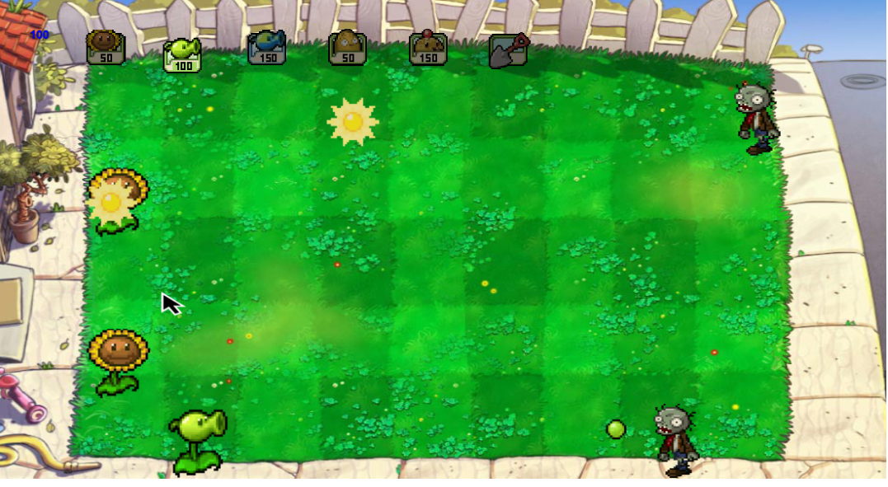

# Plantas vs Zombies

## Equipo de desarrollo

+ Juan Manuel Rama

+ Lautaro Marquez

+ Tomas Ferreyra

+ Nehuén Bergamin

+ Marcos Andiarena

## Captura

## Reglas de Juego / Instrucciones

### Cursor

Se mueve el cursor con wasd, con espacio se planta la planta seleccionada / se remueve la planta del casillero si la pala fuese seleccionada

### Seleccionar Plantas

Con q y e se desplaza hacia la izquierda y derecha respectivamente la planta seleccionada, que se puede observar arriba de todo

### Soles

Periodicamente aparecen soles (o si hay un girasol plantado este mismo los generará), para recogerlos basta con pasar con el cursor sobre ellos

Los soles se utilizan para comprar más plantas, el costo de las mismas se observa en el cabezal

### Zombies

Los zombies aparecen en hordas, debés utilizar las plantas para evitar que llegen a tu casa, si lo hacen pierdes

## Otros

+ UTN FRBA, Juves Turno Tarde
+ Versión de wollok : 0.2.9
+ No tenemos problema que sea público
